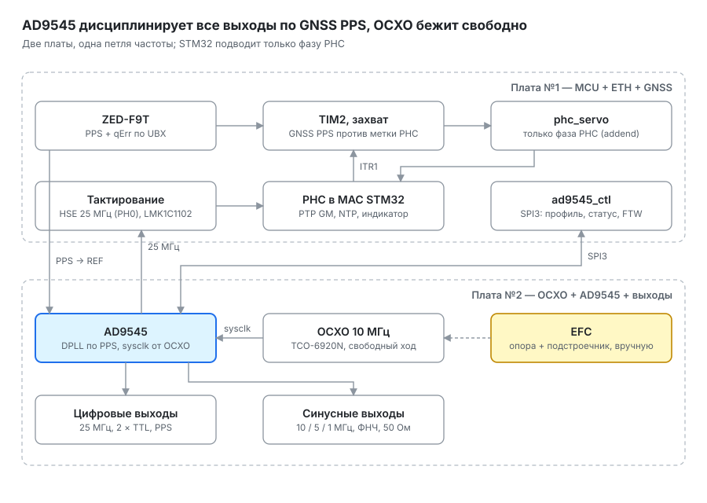

# DOROGO

**D**isciplined **O**scillator, **R**eference **O**utput, **G**LONASS‑locked **O**peration
 (в узком кругу — Disciplined Oscillator, Ruinously Overpriced, GLONASS‑locked Operation)

Эталон частоты и времени для домашней лаборатории: термостатированный кварцевый генератор 10 МГц, дисциплинированный по GNSS (GPS, ГЛОНАСС, Galileo, BeiDou). Прибор раздаёт синусные опоры частотомерам и генераторам, работает PTP-гранд-мастером и NTP-сервером Stratum 1, а текущее время показывает на советском ВЛИ ИЛЦ1-8/7Л от авиационного хронометра ХАЭ-85М.

## Что умеет

| Функция | Параметры |
| --- | --- |
| Точность времени | Гарантированно ≤ 40 нс к UTC (ITU-T G.8272, PRTC-B); цель ≤ 5 нс на выходе PPS после калибровки задержек |
| Синусные опоры | 10 МГц (2–3 выхода), 5 МГц и 1 МГц (по 1–2 выхода), 50 Ом |
| Цифровые выходы | 2 × TTL с программируемой частотой, PPS |
| Сеть | PTP IEEE 1588-2019 (гранд-мастер, профиль G.8275.1, аппаратные метки), NTP Stratum 1 (RFC 5905) |
| Holdover | Работа без спутников на свободно бегущем SC-cut OCXO с прогнозом старения |
| Управление | Веб-страница статуса и раздел настроек, `/api/status` и `/metrics`, shell по USB и Telnet, 4 кнопки на панели |
| Индикация | ИЛЦ1-8/7Л: секундная стрелка и два 4-разрядных блока, смена кадра ровно на границе секунды |
| Обновление | Прибор сам забирает подписанный образ по Ethernet (MCUboot с откатом) |

## Как устроен

Частоту всех выходов дисциплинирует синтезатор **AD9545**: его DPLL с полосой в миллигерцы заперт на PPS приёмника **u-blox ZED-F9T**, а OCXO **Epson TCO-6920N** бежит свободно и задаёт стабильность на коротких интервалах и в holdover. Микроконтроллер **STM32F407** под **Zephyr RTOS** настраивает синтезатор и следит за ним, держит фазу аппаратных часов PTP относительно GNSS и раздаёт время по сети через PHY **DP83640**.

Подробно — в [описании архитектуры](hw/ARCHITECTURE.md): требования, платы и доработки, тракты сигналов, архитектура ПО, калибровка, стенд и порядок работ.

## Состояние

| Узел | Статус |
| --- | --- |
| Плата №1: MCU + Ethernet + GNSS | Изготовлена; нужна одна обязательная доработка ([список](hw/ARCHITECTURE.md#доработки)) |
| Плата индикатора ИЛЦ1-8/7Л | Изготовлена; демо-прошивка работает ([`fw/ilc_demo`](fw/ilc_demo)) |
| Плата №2: OCXO + AD9545 + выходы | Проектируется; ждёт характеризации OCXO |
| Плата питания | Не начата |
| Прошивка на Zephyr | Архитектура согласована, код не начат |

## Структура репозитория

| Каталог | Содержимое |
| --- | --- |
| [`hw/`](hw) | Аппаратная часть: [архитектура](hw/ARCHITECTURE.md), схемы и платы DipTrace по узлам, структурные схемы в [`hw/img`](hw/img) |
| [`hw/legacy/`](hw/legacy) | Платы ранних версий v0.1–v0.3 — для истории, в новую архитектуру не входят |
| [`fw/`](fw) | Прошивки: демо индикатора сейчас, приложение на Zephyr — далее |
| [`au/`](au) | Сборочные единицы (assembly units): сюда подключаются внешние проекты как git submodules |

## Инструменты

- Схемы и платы — DipTrace (`.dch`, `.dip`).
- Прошивка — Zephyr RTOS 4.4; демо индикатора — PlatformIO.
- Отладка — ST-LINK V3 через OpenOCD (SWD, SWO, RTT); трасса ETM — логический анализатор и отдельный проект трассировщика.
- Синтезатор — профили из Analog Devices ACE.
- Стабильность — TimeLab; ВЧ-тракты и задержки кабелей — LiteVNA.

## История

Проект начался в 2019 году как GPSDO на ФАПЧ 4046 с Arduino для NTP. В версии 0.3 (2025) он вырос до стопки плат 80 × 80 мм в корпусе авиационного прибора 85 × 85 мм на TM4C123, LEA-M8T и W5500. В версии 0.4 (2026) цель сместилась к PTP-гранд-мастеру, и архитектуру пересобрали вокруг STM32F407, DP83640, ZED-F9T и AD9545. Ревизия 2 архитектуры (октябрь 2026) перенесла дисциплинирование целиком в AD9545.

## Лицензия

BSD 2-Clause — см. [LICENCE](LICENCE).
