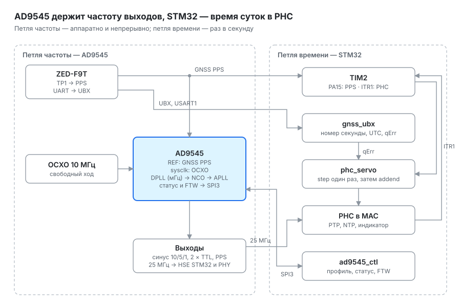
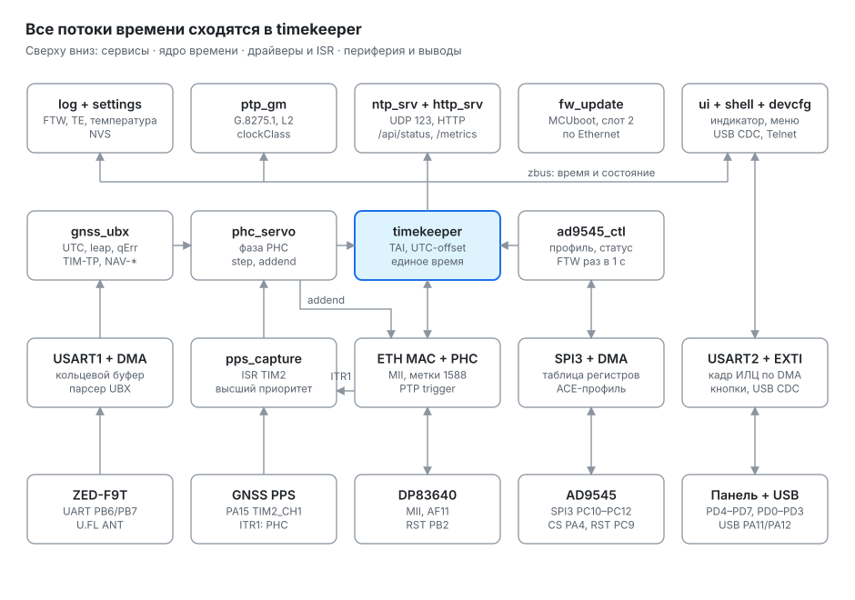
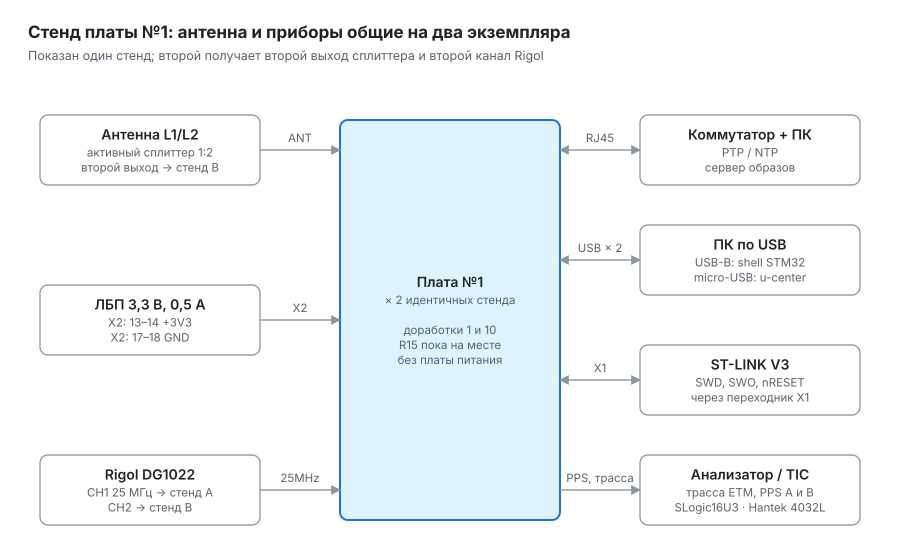

# DOROGO — архитектура GNSS-дисциплинированного OCXO

Ревизия 2 · октябрь 2026. Документ описывает целевую архитектуру; устаревшие решения v0.1–v0.3 — в [`legacy/`](legacy/).

## Назначение и требования

DOROGO — эталон частоты и времени для домашней лаборатории: OCXO 10 МГц, дисциплинируемый по GNSS, с синусными опорами для приборов, PTP-гранд-мастером и NTP Stratum 1 в сети. Цель по времени — max|TE\_L| ≤ 5 нс относительно UTC на PPS-выходе; гарантированный уровень — PRTC-B (≤ 40 нс).

| Параметр | Требование | Примечание |
| --- | --- | --- |
| Точность времени, max\|TE\| | ≤ 40 нс (PRTC-B) гарантированно; цель max\|TE\_L\| ≤ 5 нс на PPS-выходе; по PTP в v1 — ≤ 40 нс (SFP-модуль с переходом 100 Мбит/с ↔ 1 Гбит/с), 5 нс по PTP — в v2 с гигабитным интерфейсом без смены скорости | 5 нс требует калибровки задержек антенны, кабеля и тракта PPS, а для PTP — меток времени в DP83640 вместо MAC STM32. Проверка — аппаратурой коллег-телекомщиков |
| Стабильность частоты в захвате | \~10⁻¹² на интервале 1 сутки | Определяется OCXO на коротких интервалах, GNSS на длинных |
| Holdover | Продолжение работы без GNSS с прогнозом старения | Количественное требование задать после характеризации OCXO |
| 10 МГц, синус, 50 Ом | 2–3 выхода | С AD9545 через ФНЧ и буфер |
| 5 МГц и 1 МГц, синус, 50 Ом | по 1–2 выхода | Частотомеры (5 МГц), Г4-158 (1 МГц) |
| TTL, 50 Ом | 2 выхода, частота программируется | С AD9545, задаётся кнопками |
| PPS | 1 выход, дисциплинированный | С AD9545, выровнен по UTC |
| PTP | IEEE 1588-2019, роль Grandmaster, аппаратные метки | Профиль G.8275.1: домен 24, L2 01-80-C2-00-00-0E, E2E, two-step; для запуска — default по IPv4. Коммутатор Mikrotik CRS326 |
| NTP | RFC 5905, Stratum 1 | Аппаратные метки на приёме |
| Индикация | Время и дата на ИЛЦ1-8/7Л, смена кадра на границе секунды; секундная стрелка и два 4-разрядных блока семисегментных индикаторов | 4 кнопки, как у ХАЭ-85М |
| Обновление и отладка | Самообновление по Ethernet: прибор сам забирает образ; отладка по SWD + ETM | MCUboot с откатом при сбое; полноценный JTAG невозможен — PA15 (JTDI) занят PPS |

## Системная архитектура

Петля дисциплинирования целиком внутри AD9545: его DPLL заперт на GNSS PPS, OCXO работает свободно как системный такт, а STM32 только настраивает синтезатор, следит за его состоянием и подводит фазу PHC.

Читать по стрелкам: GNSS PPS заходит в DPLL AD9545, тот подтягивает все выходы к PPS, опираясь на свободно бегущий OCXO; 25 МГц с синтезатора тактируют STM32, а STM32 только настраивает синтезатор и подводит фазу PHC.

- Петля: GNSS PPS (U.FL с платы №1) → опорный вход AD9545 → DPLL с полосой в миллигерцы → APLL → все выходы. OCXO подаётся на системное тактирование и задаёт стабильность на коротких интервалах и в holdover.
- Единая шкала: AD9545 → 25 МГц → HSE STM32 и DP83640. Таймеры, PHC и PHY синтонизированы с GNSS через синтезатор.
- STM32: загрузка профиля по SPI3, статус DPLL (свободный ход, захват, holdover), чтение FTW — это измеренное отклонение OCXO; его журнал — основа прогноза старения.
- PHC: частоту подстраивать не нужно, 25 МГц уже дисциплинированы. TIM2 меряет остаток фазы между GNSS PPS и PHC, PHC подводится по фазе через addend.
- EFC с платы №1 не используется: на вход EFC подаётся напряжение от точной опоры через многооборотный подстроечник, для редкой ручной подстройки OCXO к номиналу.
- Отклонено: аналоговое дисциплинирование через EFC и гибрид «AD9545 измеряет, STM32 рулит».

## Кто что корректирует: AD9545 и STM32

Частоту и фазу всех выходов подстраивает AD9545 сам, аппаратно, без участия STM32. STM32 отвечает за другое — за время суток: какой номер у текущей секунды и где ровно начинается секунда в его счётчике PHC. Это две разные задачи, поэтому и петли две.

Петля частоты (слева) работает в AD9545 непрерывно. Петля времени (справа) работает в STM32 раз в секунду и трогает только PHC: его частота уже правильная, потому что он тактируется дисциплинированными 25 МГц, так что после разового step остаются малые поправки фазы.

| Задача | Кто | Сигналы и выводы | Как часто |
| --- | --- | --- | --- |
| Частота и фаза выходов: синус 10/5/1 МГц, TTL, PPS, 25 МГц | AD9545, аппаратно | REF ← GNSS PPS (сеть GPS\_PPS, U.FL «PPS»); sysclk ← OCXO 10 МГц | Непрерывно, полоса DPLL в мГц |
| Настройка и контроль петли частоты | STM32, ad9545\_ctl | SPI3: PC10 / PC11 / PC12, CS PA4, сброс PC9 | Профиль при старте; статус и FTW раз в секунду |
| Номер секунды, UTC, leap, qErr | STM32, gnss\_ubx | USART1: PB6 / PB7, UBX NAV-TIMEUTC, NAV-TIMELS, TIM-TP | Раз в секунду |
| Фаза PHC относительно GNSS PPS | STM32, TIM2 + phc\_servo | PA15 = TIM2\_CH1 (GNSS PPS); ITR1 = PTP trigger (секунда PHC); поправка qErr | Раз в секунду: step один раз, затем малые поправки addend |
| Частота PHC | Никто отдельно — следует из тактирования | AD9545 → U.FL «25MHz» → LMK1C1102 → PH0 (HSE) и X1 DP83640 | — |
| Раздача времени | STM32 | PTP и NTP через MAC; индикатор USART2 + LAT (PD6) | По запросу; индикатор раз в секунду |

qErr учитывается только в петле времени STM32. Можно ли передавать его в AD9545 — открытый вопрос; без этого петля частоты полагается на усреднение узкой полосой DPLL.

## Плата №1 (MCU + ETH + GNSS)

Плата пригодна к работе после одной обязательной доработки (п. 1); доработки цепи EFC (п. 2–4) вынесены в [приложение](#приложение-если-цепь-efc-на-плате-1-всё-же-запаяна); ключевые сигналы разведены на правильные периферийные блоки. Нетлист — [`mcu_eth_gnss/mcu_eth_gnss.net`](mcu_eth_gnss/mcu_eth_gnss.net). Состав: STM32F407VGT6, DP83640 по MII, ZED-F9T, LMK1C1102, цепь EFC (ADR5041 → DAC80501 → AD8638). Своего стабилизатора 3,3 В на плате нет: +3V3 и +5Va приходят с платы питания через X2.

### Распределение ключевых сигналов

| Сигнал | Вывод STM32 | Периферия | Использование |
| --- | --- | --- | --- |
| GNSS PPS (TP1 ZED-F9T) | PA15 | TIM2\_CH1 | Захват PPS 32-битным таймером, 84 МГц |
| GNSS PPS | — | GPIO1 DP83640 | Резервный захват событий в часах PHY, 8 нс |
| Метка секунды PHC | внутр. | TIM2 ITR1 (remap на PTP trigger) | Target time на каждую следующую секунду |
| GNSS UART | PB6 / PB7 | USART1 TX / RX | Только UBX |
| AD9545 SPI | PC10 / PC11 / PC12, CS PA4, RST PC9 | SPI3 | Настройка синтезатора |
| DAC80501 | PA5 / PB5 | SPI1 или программный I²C | Зависит от доработки п. 4 |
| Индикатор | PD5 DATA, PD7 CLK, PD6 LAT, PD4 CLR | USART2 синхронный + DMA | LAT из ISR TIM2 на границе секунды (у PD6 нет таймерного канала) |
| Кнопки | PD0–PD3 | EXTI0–EXTI3 | Каждая на своей линии прерывания |
| Ethernet | MII, AF11 | ETH MAC | Сброс PHY: PB2 |
| Трасса | PE2–PE6, SWO PB3 | TPIU/ETM | 4 бита + TRACECLK на X1 |
| USB | PA11 / PA12, VBUS PA9 | OTG FS | CDC, после доработки п. 1 |

### Доработки

| № | Проблема | Где | Доработка | Срочность |
| --- | --- | --- | --- | --- |
| 1 | 25 МГц от LMK1C1102 (Y0) приходят на PC14 — вход LSE (OSC32\_IN), он не принимает такую частоту | U2 ножка 8 | Перерезать дорожку, завести Y0 на PH0 (ножка 12, вход HSE) | Обязательно |
| 6 | На цепи PPS висят светодиод, 22 пФ и выход U.FL — фронт зависит от внешней нагрузки | R23, HL1, C27 | R23 оставить: через этот U.FL GNSS PPS идёт на опорный вход AD9545. Короткий коаксиал; HL1 — отладочный, в итоговом устройстве не запаивается | Желательно |
| 7 | R15 (49,9 Ом) на входе LMK1C1102 — удобно для Rigol, но драйвер с платы №2 даст половинную амплитуду | R15 | Согласование верное. Для Rigol: нагрузка 50 Ом, размах 3,3 В, смещение 1,65 В. Финально R15 снять: линия \~5 см, на плате №2 последовательная терминация 33 Ом (раздел платы №2). После снятия R15 у Rigol выставить нагрузку High-Z | Учесть в плате №2 |
| 8 | Нет входа для возврата PPS: каналы TIM2/TIM5 заняты Ethernet | — | Не нужен: задержки калибруются один раз внешней аппаратурой (раздел «Разовая калибровка задержек»). Для постоянного самоконтроля — проводок на EXTINT ZED-F9T (ножка 51, TIM-TM2) или на PD12 (TIM4\_CH1) | Позже |
| 9 | Аккумулятор MS621FE заряжается через TVS без ограничения тока | VD2, B1 | Последовательно около 1 кОм | Желательно |
| 10 | BOOT0 на земле, nRESET не выведен на X1 | U2, X1 | Обновление — своим загрузчиком (MCUboot) по Ethernet, BOOT0 для этого не нужен. Отладка — только SWD + ETM, не JTAG: PA15 (JTDI) занят PPS. Проводок NRST (ножка 14 U2) на ножку 10 X1 (nRESET). Ножка 8 X1 (TDI) остаётся пустой: PA15 занят PPS | Сделать |
| 11 | Пустые номиналы C21, C22, L1–L5 | ВЧ-тракт, питание | Сверить с референсной схемой u-blox | Проверить |

## Плата №2 (OCXO + AD9545 + выходы)

Все выходы формирует AD9545, дисциплинированный по GNSS PPS; синусные получаются из его выходов фильтрами нижних частот. Опоры для приборов при этом зависят от конфигурации синтезатора, поэтому она должна восстанавливаться сразу при включении.

### Тракты сигналов

| Выход | Источник | Тракт | Количество |
| --- | --- | --- | --- |
| 10 МГц синус, 50 Ом | AD9545 | ФНЧ 5–7 порядка → буфер на каждый выход, последовательно 50 Ом | 2–3 |
| 5 МГц синус, 50 Ом | AD9545 | Выход AD9545 → ФНЧ 5–7 порядка → буфер | 1–2 |
| 1 МГц синус, 50 Ом | AD9545 | Выход AD9545 → ФНЧ → буфер | 1–2 |
| 25 МГц LVCMOS | AD9545 | Дифференциальный выход → драйвер 50 Ом (см. ниже) → U.FL на плату №1 | 1 |
| TTL, программируемый | AD9545 | Дифференциальный выход → драйвер 74ACT-класса 5 В, последовательно 50 Ом | 2 |
| PPS | AD9545 | Выход 1 Гц (проверить по даташиту) → драйвер | 1 |

AD9545: опорный вход — GNSS PPS с платы №1 по U.FL, системное тактирование — от OCXO. Проверить по даташиту, принимает ли вход системного тактирования 10 МГц напрямую; если нет — свой системный кварц и компенсация системного такта по OCXO, поданному на второй опорный вход. На \~AD\_RST — подтяжка к питанию, чтобы сброс МК не обрывал выходы.

### Драйвер 25 МГц для платы №1

Коаксиал между платами около 5 см — электрически короткий для фронтов 1–3 нс, поэтому параллельная терминация не нужна. R15 на плате №1 не запаивается, на плате №2 у драйвера стоит последовательный резистор.

| Параметр | Требование |
| --- | --- |
| Вход | Дифференциальный выход AD9545, 25 МГц (режим выхода — по даташиту) |
| Нагрузка | Коаксиал U.FL \~5 см, на конце высокоомный вход LMK1C1102 (R15 на плате №1 не запаян) |
| Уровень на входе LMK1C1102 | Высокий ≥ 0,7·VDD (≈ 2,3 В), низкий ≤ 0,3·VDD (≈ 1 В) — сверить с даташитом LMK1C1102 |
| Реализация | Дифференциальный приёмник (ADCMP601 из BOM или LVDS-приёмник класса SN65LVDS2) → один LVCMOS-буфер 3,3 В (74LVC1G34 или аналог) → последовательно 33 Ом → U.FL |
| Согласование | Выходное сопротивление буфера (\~15–20 Ом) + 33 Ом ≈ 50 Ом; отражение от высокоомного конца гасится на источнике |
| Питание | LDO 3,3 В, 100 нФ у буфера |
| Сигнал | Скважность 50 ± 5 %, фронты 1–3 нс |

### Цепь EFC (необязательная)

EFC в петле не участвует. Он нужен только для редкой подстройки OCXO к номиналу, чтобы NCO синтезатора не уходил далеко от нуля.

- Решение: EFC с платы №1 не используется, выход «Corr» остаётся неподключённым.
- Ручная подстройка: опора с низким ТКН (или вывод опорного напряжения OCXO, если он есть по даташиту) → резисторы с низким ТКН → многооборотный подстроечник, который охватывает лишь узкое окно вокруг рабочей точки → RC-фильтр 0,1–1 Гц на плёночных конденсаторах рядом с OCXO. Узкое окно снижает влияние дрейфа и шума движка на частоту.
- В обоих случаях — защита входа EFC от выхода за допустимый диапазон по даташиту.

### Формирователь синуса OCXO

Синус OCXO → AC-развязка → компаратор с малым добавочным джиттером (LTC6957 или уже выбранный ADCMP601) → вход системного тактирования AD9545 (или прямо синусом, если вход это допускает).

### Питание

| Шина | Источник | Нагрузка | Примечание |
| --- | --- | --- | --- |
| \~13,5 В | Импульсный понижающий от VIN 20–24 В | Предстабилизатор | Запас 1,5 В для LDO |
| 12 В OCXO | Два LT3045 в параллель | OCXO, до 1 А при прогреве | Рассеивание около 1,5 Вт при прогреве; ток прогрева измерить |
| 12 В аналог | Отдельный малошумящий LDO | Опора и ОУ EFC, буферы синуса | Отдельный от OCXO |
| 3,3 В аналог | LDO | AD9545, компаратор, делители | Цифра платы №1 питается отдельно |

Обратный ток OCXO ведётся отдельным проводником к звезде, чтобы ток подогрева не проходил по земле опоры EFC.

## Архитектура ПО (Zephyr)

Частоту дисциплинирует AD9545, поэтому у прошивки три задачи: настроить синтезатор и следить за ним, подвести фазу PHC к GNSS PPS, раздать время по PTP, NTP и на индикатор. Все потребители читают время из одного места — timekeeper.

### Структурная схема

Читать снизу вверх: каждый столбец — одна подсистема от выводов до сервиса. Горизонтальная шина между ядром и сервисами — раздача времени и состояния из timekeeper. fw\_update работает через сетевой стек поверх ETH MAC и с временем не связан.

| Откуда → куда | Данные | Механизм | Период |
| --- | --- | --- | --- |
| pps\_capture → phc\_servo | Захваты TIM2: фронт GNSS PPS (CH1) и метка секунды PHC (ITR1) | k\_msgq из ISR | 1 с |
| gnss\_ubx → phc\_servo | qErr следующего импульса (TIM-TP) | Очередь по TOW | 1 с |
| gnss\_ubx → timekeeper | Номер секунды, UTC, leap, наличие фикса | zbus | 1 с |
| phc\_servo → ETH MAC | Step и addend PHC | API ptp\_clock | 1 с, step один раз |
| ETH MAC → pps\_capture | Сигнал target time PHC | Аппаратно, TIM2 ITR1 | 1 с |
| ad9545\_ctl ↔ SPI3 | Регистры профиля, статус DPLL, FTW | SPI3 + DMA | Профиль при старте, статус 1 с |
| ad9545\_ctl → timekeeper | Состояние DPLL (свободный ход, захват, holdover) | zbus | По событию |
| timekeeper → ptp\_gm, ntp\_srv | Время PHC, clockClass, LI, root dispersion | Вызов + zbus | По запросу |
| timekeeper → ui | Секунда, дата, состояние | zbus; защёлка LAT (PD6) в ISR сравнения TIM2 | 1 с |
| timekeeper, ad9545\_ctl → log | FTW, TE, температура | zbus → NVS | 1 мин |
| fw\_update ↔ ETH | Образ прошивки | Сокеты → слот 2 флеша | По команде |
| ui + shell ↔ USB OTG FS | Команды, телеметрия | CDC ACM | — |

Приоритеты: ISR TIM2 выше всех (после него — DMA USART1), затем поток phc\_servo, сетевой стек и ptp\_gm, ad9545\_ctl, ниже всех — ui, log и shell.

### Модули

| Модуль | Контекст | Вход | Выход | Ключевое |
| --- | --- | --- | --- | --- |
| clock\_boot | Старт, до сети | — | HSE от AD9545 | Загрузка на HSI → PHY в сбросе (PB2) → настройка AD9545 по SPI3 → ожидание захвата → переход на HSE → PHY из сброса |
| gnss\_ubx | Поток, UART DMA | USART1 | qErr, UTC, leap, fix, survey-in | Только UBX: TIM-TP, NAV-TIMEUTC, NAV-TIMELS, NAV-SAT, TIM-SVIN. qErr из TIM-TP относится к следующему импульсу — очередь по TOW |
| pps\_capture | ISR TIM2, высший приоритет | PA15, ITR1 | Отсчёт TE в msgq | Минимальный ISR; проверка интервала 1 с; пропуски помечаются |
| phc\_servo | Поток, 1 Гц | TE, qErr | addend PHC | Только фаза: PI по остатку TE, отбраковка выбросов по медиане. Частоту PHC не трогает — 25 МГц уже дисциплинированы |
| efc\_dac | Вызов из servo | Решение пользователя | DAC80501 | Не используется: EFC задаётся вручную подстроечником на плате №2. Модуль остаётся заделом |
| timekeeper | Библиотека | PHC MAC, UTC-offset, leap | Время для всех | PHC держится в TAI; step разрешён только в ACQUIRE |
| ptp\_gm | Сетевой стек | PHC, состояние DPLL | PTP | Аппаратные метки MAC STM32. clockClass: 6 в захвате, 7 в holdover в пределах, 140/150/160 вне, 248 без синхронизации |
| ntp\_srv | UDP 123 | PHC, метка приёма | NTP | MAC ставит метки на все принятые кадры — точность лучше 1 мкс. Stratum 1, refid GNSS; LI = 3 до первого захвата |
| ui | Поток, низкий приоритет | Время, кнопки PD0–PD3 | Индикатор | Кадр выдвигается USART2 с DMA заранее (развернуть порядок бит), LAT — в ISR сравнения TIM2 на границе секунды |
| ad9545 | Вызов | Таблица регистров из ACE | SPI3 | Профиль из ACE; статус DPLL (свободный ход, захват, holdover) и FTW раз в секунду; программирование TTL. Источник состояния для clockClass и индикатора |
| telemetry | Поток | Всё | USB CDC shell, UDP/HTTP | TE, EFC, температура, спутники, состояние; ADEV считается снаружи |
| log | Раз в минуту | FTW AD9545, температура, TE | Флеш (NVS/ZMS) | База для прогноза старения в holdover |
| bootloader + fw\_update | MCUboot при старте; поток обновления | Образ с сервера по Ethernet | Новый образ во втором слоте | Прибор сам забирает подписанный образ во второй слот флеша, MCUboot проверяет подпись и меняет слоты, при сбое — откат. Разметку 1 МБ флеша F407 (секторы 16/64/128 КБ) спланировать заранее: загрузчик, settings, два слота |
| devcfg | Библиотека | HTTP, shell, кнопки | Настройки в NVS, события в zbus | Единая модель настроек с проверкой значений; см. раздел «Управление прибором» |
| http\_srv | Сетевой стек | timekeeper, ad9545\_ctl, devcfg | /, /settings, /api/status, /metrics | HTTP-сервер Zephyr: статика, REST/JSON, текстовый формат Prometheus; раздел настроек под паролем |

### Состояния прибора

1. WARMUP — прогрев OCXO, загрузка профиля AD9545, ожидание захвата GNSS; выходы в свободном ходе.
2. ACQUIRE — DPLL AD9545 захватывает PPS; разовый step PHC к UTC.
3. LOCKED — DPLL в захвате, phc\_servo держит фазу PHC; clockClass 6.
4. HOLDOVER — GNSS потерян: AD9545 держит усреднённый FTW, стабильность определяет OCXO; clockClass 7, растёт root dispersion NTP.
5. RECOVERY — GNSS вернулся: DPLL плавно возвращается к PPS по фазе, затем LOCKED.

### Измерение

Основной канал: TIM2 захватывает GNSS PPS (CH1) и метку PHC (ITR1). Разность минус qErr даёт TE с шумом около 3–4 нс СКО на отсчёт. Контрольный канал: захват событий DP83640 на GPIO1 (8 нс) — сверка с TIM2 и задел для PTP на уровне PHY.

Zephyr: проверить в 4.4 поддержку роли GM и нужного профиля в `subsys/net/lib/ptp`. Готового драйвера AD9545 в Zephyr, скорее всего, нет — таблица регистров из ACE проще.

## Управление прибором

Все интерфейсы управления работают через один модуль devcfg, поэтому кнопки, веб и консоль видят одни и те же настройки. SCPI не делаем: частоты выходов задаются один раз при подключении приборов и почти не меняются.

| Интерфейс | Доступ | Что умеет |
| --- | --- | --- |
| HTTP, статусная страница `/` | Открыт, только чтение | Состояние DPLL и GNSS, спутники, TE, FTW, clockClass, частоты выходов, время работы |
| HTTP, раздел настроек `/settings` | Пароль; без HTTPS, прибор в management-VLAN | Частоты и включение выходов AD9545, часовой пояс, параметры PTP, сеть, перезагрузка, запуск обновления прошивки |
| HTTP, машиночитаемый статус: `/api/status` (JSON) и `/metrics` (текстовый формат Prometheus) | Открыт, только чтение | Те же поля, что на статусной странице: для скриптов и для Grafana |
| Shell по USB CDC | Физический доступ | Полный доступ: настройки, диагностика, отладка |
| Shell по Telnet | Включается в настройках; на стенде включён | То же, что USB shell; автоматическая отладка на стенде без физического доступа |
| Кнопки | Физический доступ | Частоты выходов, часовой пояс, сброс сети на DHCP |

### devcfg

- Хранит схему настроек: выходы (частота, включение), часовой пояс, PTP (домен, priority1/2), сеть, пароль веб-раздела, включение Telnet.
- Проверяет значения и сохраняет их в NVS; каждое изменение публикует в zbus.
- ad9545\_ctl, ui, ptp\_gm и сеть применяют изменения сами; индикатор показывает, что настройку поменяли по сети.

### Частоты выходов AD9545

Выходы получаются целочисленным делением частоты APLL, поэтому набор достижимых частот ограничен. Веб и меню на кнопках предлагают только допустимые значения. Для нестандартных частот — несколько заранее посчитанных в ACE профилей; переключение профиля прерывает выходы, интерфейс предупреждает об этом. Детали — по даташиту AD9545.

### Кнопки

Длинное нажатие любой кнопки — вход в меню. Левые ◀ ▶ выбирают пункт или разряд, правые ▲ ▼ меняют значение, длинное нажатие — сохранить и выйти. Комбинация при включении сбрасывает сеть на DHCP, если прибор потерялся в сети.

### Shell для автоматизации

Команды shell делать пригодными для скриптов: стабильное приглашение, однозначный код результата и вариант вывода в JSON (`status --json`). Тогда отладка на стенде по Telnet идёт полностью автоматически.

## Характеризация OCXO и рабочая точка EFC

Характеристики OCXO теперь определяют holdover, а не петлю: нужны его уход в свободном ходе, рабочая точка EFC и стабильность. Измеряет сама плата №1, превращённая в частотомер с опорой от GNSS: разрешение около 10⁻¹⁰ за 100 с и около 10⁻¹¹ за 1000 с.

### Стенд

1. Плата №1 с доработкой 1.
2. OCXO TCO-6920N на лабораторном источнике 12 В; синус через формирователь (для стенда хватит ADCMP601 или 74LVC1G14) на U.FL «25MHz».
3. МК тактируется от 10 МГц: HSE bypass, M = 5, N = 168, P = 2 → 168 МГц, Q = 7 → 48 МГц для USB. Ethernet на этом этапе не работает (PHY нужны 25 МГц).
4. EFC — с лабораторного источника через последовательный резистор 10 кОм. Диапазон — по даташиту версии A.

### Порядок измерения

1. Измерить ток прогрева и выходной уровень OCXO на нагрузке 50 Ом.
2. Прогреть OCXO не меньше 1–2 часов.
3. TIM2 считает тики между импульсами GNSS PPS; после поправки на qErr Δf/f = (N − 84·10⁶) / 84·10⁶. Усреднять 100–1000 с.
4. Пройти 5–7 точек напряжения EFC вверх, затем вниз; на каждой ждать несколько минут до установления.
5. По падению на 10 кОм найти входной ток и импеданс входа EFC.

### Результат

| Величина | Как получить | Нужно для |
| --- | --- | --- |
| Крутизна, Гц/В и Δf/f на В | Наклон прямой по точкам | Ширина окна ручного подстроечника |
| Напряжение, при котором 10 МГц ровно | Пересечение прямой с нулём | Рабочая точка подстроечника; запас NCO AD9545 |
| Монотонность и гистерезис | Сравнение прохода вверх и вниз | Плавность ручной подстройки |
| Импеданс входа EFC | Падение на 10 кОм | Номиналы финального RC-фильтра |
| Выходной уровень, ток прогрева | Осциллограф на 50 Ом, амперметр | Буфер синуса, блок питания |
| Стабильность свободного хода (ADEV) | Сутки записи частоты против GNSS, расчёт в TimeLab | Полоса DPLL AD9545 (точка пересечения кривых OCXO и GNSS) и ожидаемый holdover |

Запасной способ без доработок: реципрокный частотомер с внешней опорой от эталона лучше 10⁻⁹ (например, Гиацинт, если он рубидиевый) и затвором от 10 с.

## Разовая калибровка задержек

Задержки тракта измеряются один раз внешним измерителем интервалов времени и записываются в прибор как постоянные поправки. После этого выходной PPS и PHC держатся в пределах цели 5 нс без обратной связи по выходу.

| Задержка | Чем измерить | Куда записать |
| --- | --- | --- |
| Антенна и антенный кабель | LiteVNA: групповая задержка S21 в полосах L1/L2 после калибровки thru, или по S11 с открытым концом (половина задержки туда-обратно); активную антенну — через внешний bias-tee и аттенюатор. Запасной вариант — паспорт кабеля (около 5 нс/м при коэффициенте укорочения 0,66) или рефлектометр | CFG-TP-ANT\_CABLEDELAY в ZED-F9T |
| Выходной PPS прибора относительно эталонного PPS | Измеритель интервалов времени коллег, эталон, привязанный к UTC; усреднение не меньше суток | Фазовый сдвиг выхода в профиле AD9545 (возможность — по даташиту) и settings прибора |
| PTP на порту коммутатора | PTP-тестер коллег | Постоянная поправка в timekeeper или delayAsymmetry PTP |
| Кабели измерительной установки | LiteVNA (групповая задержка S21 на рабочей частоте) или паспорт кабелей | Вычесть из результатов |

1. Прогреть прибор не меньше 24 часов: DPLL в захвате, survey-in ZED-F9T завершён.
2. Записать задержку антенного кабеля в ZED-F9T.
3. Подключить выходной PPS прибора и эталонный PPS к измерителю интервалов, усреднять сутки; среднее за вычетом кабелей установки — поправка выхода.
4. Записать поправку в профиль AD9545 и в settings прибора, повторить измерение для проверки.
5. Проверить PTP тестером на порту коммутатора; среднее смещение — поправка в timekeeper.
6. Повторять после замены антенны, кабелей, драйверов выхода или профиля AD9545.

## Измерения с LiteVNA

LiteVNA закрывает в проекте всё, что касается ВЧ-трактов и задержек кабелей: антенный тракт, вход ZED-F9T, ФНЧ синусных выходов и кабели измерительной установки. Фазовый шум, ADEV и PPS им не измерить — для этого нужны частотомер или измеритель интервалов и TimeLab.

| Что измерить | Режим и полоса | Подключение | Результат и критерий |
| --- | --- | --- | --- |
| Антенный кабель | Групповая задержка S21, 1,15–1,65 ГГц (L1/L2) | Калибровка thru на концах кабеля, затем кабель между портами | Задержка в нс → CFG-TP-ANT\_CABLEDELAY; потери на L1/L2 |
| Сплиттер стенда | S21 обоих выходов, 1,15–1,65 ГГц | Вход сплиттера на порт 1, каждый выход по очереди на порт 2; питание антенны выключено | Потери и разность задержек выходов — поправка при сравнении двух стендов |
| Вход RF\_IN ZED-F9T | S11, 1,15–1,65 ГГц | U.FL «ANT» платы №1, плата обесточена | Согласование после установки C22/L2: обратные потери на L1/L2 не хуже \~10 дБ |
| ФНЧ синусных выходов | S21 и S11, 0,1–100 МГц | Фильтр отдельно на тестовой плате или до запайки драйвера | Потери на 1/5/10 МГц ≤ 1 дБ; подавление 2-й и 3-й гармоники ≥ 40 дБ; обратные потери на рабочей частоте ≥ 15 дБ |
| Кабели измерительной установки | Групповая задержка S21 на рабочей частоте (10 МГц и выше) | Калибровка thru, затем каждый кабель между портами | Задержки кабелей для вычитания при калибровке PPS и PTP |

Правила работы:

- Калибровать в плоскости измерения: SOLT с переходниками U.FL → SMA на месте, а не на концах штатных кабелей прибора.
- Не подключать VNA к ANT работающей платы: на U.FL «ANT» есть 3,3 В питания антенны. Плата обесточена или в разрыве DC-блок.
- Активные узлы (LNA антенны, буферы) мерить только через bias-tee и аттенюатор 20–30 дБ на входе VNA; допустимую мощность на входе брать из паспорта прибора.
- Для групповой задержки сужать полосу ПЧ и включать усреднение: шум задержки обратно пропорционален шагу частоты и мощности сигнала.
- U.FL рассчитаны на десятки подключений: для частых измерений ставить переходники один раз и дальше работать через SMA.

## Порядок работ и открытые вопросы

Первая веха — плата №1, которая измеряет OCXO относительно GNSS: она проверяет всю измерительную цепочку и даёт цифры для разводки платы №2.

### Вехи

1. Сборка двух идентичных экземпляров каждой платы. Сравнение двух приборов между собой (10 МГц и PPS через фазовый компаратор или измеритель интервалов) даёт первичную оценку джиттера и стабильности без внешнего эталона; общая антенна через сплиттер исключает ошибки GNSS и показывает собственный шум приборов.
2. Доработка платы №1 (п. 1), подача питания со стенда через X2.
3. Zephyr на плате: UBX, захват PPS на TIM2, shell по USB. Проверка на 25 МГц от Rigol: прибор показывает уход Rigol в ppb.
4. Режим «частотомер»: характеризация TCO-6920N и крутизны EFC.
5. PHC + TIM2/ITR1 → TE; NTP-сервер.
6. Индикатор: время с переключением на границе секунды.
7. Плата №2 минимальная: OCXO на системном такте AD9545, GNSS PPS на опорном входе, выход 25 МГц. Захват DPLL, ночные прогоны, ADEV в TimeLab.
8. PTP GM: калибровка задержек (антенный кабель, PHY), проверка против коммутатора 40G.
9. Выходы: синусные 10/5/1 МГц, программируемые TTL, PPS; прогноз старения для holdover; меню на кнопках.

### Сборка стенда (веха 1)

Два идентичных стенда с платой №1 работают без платы питания и платы №2: питание 3,3 В с лабораторного источника, 25 МГц с Rigol, антенна и измерительные приборы общие.

Схема показывает один стенд; второй получает второй выход сплиттера и второй канал Rigol, а его PPS идёт на второй вход того же осциллографа или измерителя интервалов.

| Подключение | Куда на плате | Чем | Примечание |
| --- | --- | --- | --- |
| Питание | X2: 13–14 (+3V3), 17–18 (GND) | Лабораторный источник 3,3 В, ограничение тока 0,5 А | Стабилизатора 3,3 В на плате нет. VIN и +5Va не нужны: антенна питается от +3V3 через R29 |
| 25 МГц | U.FL «25MHz» | Rigol DG1022: CH1 на стенд A, CH2 на стенд B | Нагрузка 50 Ом, размах 3,3 В, смещение 1,65 В (R15 пока на месте). Без него не работают Ethernet и, после доработки 1, тактирование МК от HSE |
| Антенна | U.FL «ANT» | Одна двухчастотная антенна L1/L2 и активный сплиттер 1:2 | Питание на антенну пропускает только один порт сплиттера, второй с развязкой по постоянному току |
| Ethernet | RJ45 | Коммутатор и ПК | На ПК — сервер образов прошивки, клиенты PTP и NTP |
| USB STM32 | USB-B | ПК | Shell и телеметрия по CDC; только после доработки 1 (HSE) |
| USB ZED-F9T | micro-USB | ПК | u-center для настройки и проверки приёмника |
| Отладка | X1, 20 контактов 1,27 мм | ST-LINK V3 (SWD, SWO, nRESET) через переходник | ST-LINK не снимает 4-битную трассу ETM; nRESET — после доработки 10 |
| Трасса | X1: TRACECLK, TRACED0–3 | Sipeed SLogic16U3 (поток, асинхронно) или Hantek 4032L (state-режим по обоим фронтам, окно в буфер) через тот же переходник | Декодирование в Orbuculum и OpenCSD. Полноценный потоковый зонд — отдельный проект трассировщика |
| PPS | U.FL «PPS» | Осциллограф или измеритель интервалов, второй вход — PPS стенда B | При общей антенне разность двух PPS — собственный шум приёмников |

Программатор: ST-LINK V3 (MINIE или SET) подходит для прошивки и отладки по SWD с SWO; дешёвые клоны ST-LINK V2 тоже прошьют, но SWO и nRESET у них ненадёжны. На каждый стенд — свой переходник: 20-контактный X1 → разъём под ST-LINK и гребёнка под логический анализатор с линиями трассы и PPS. Один ST-LINK можно перетаскивать между стендами, а дальше прошивка будет обновляться по Ethernet.

### Открытые вопросы

- [x] Какой вариант доработки DAC80501: I²C (SPI2C на VDD) или SPI (отдельный SYNC)?
- [x] Откуда взять +12 В для AD8638 на плате №1: проводок или свободный контакт X2?
- [x] Какой профиль PTP ждёт коммутатор 40G: default или G.8275.x?
- [ ] Как подключиться к CRS326-24S+2Q+: PTP там работает только на SFP+ и QSFP+, а DP83640 умеет лишь 10/100 Мбит/с. Нужен медный SFP-модуль, который держит 100 Мбит/с в порту SFP+ (проверить), — решение: модуль 1000BASE-T с поддержкой 10/100/1000 и согласованием скорости внутри модуля; асимметрию и разброс задержки его буфера измерить на стенде; постоянную асимметрию учесть через delayAsymmetry PTP. Медный модуль добавляет свою задержку — её учесть при калибровке.
- [ ] Проверить на стенде вариант без смены скорости: порт SFP+ принудительно на 100 Мбит/с (SGMII), автосогласование выключено с обеих сторон, на DP83640 тоже фиксированные 100 Мбит/с, полный дуплекс. Если порт и модуль это держат и PTP на порту работает, модуль не буферизует кадры, и асимметрия сводится к задержкам PHY.
- [ ] Поддерживает ли PTP-стек Zephyr 4.4 роль GM в нужном профиле? Ответ по документации Zephyr: транспорт IEEE 802.3 (L2, 0x88F7) есть, Sync по L2 — two-step, бэкпорт в ветку v4.4 ([PR #106464](https://github.com/zephyrproject-rtos/zephyr/pull/106464)); Ordinary и Boundary Clock есть; режима TIME\_TRANSMITTER\_ONLY нет, поэтому GM — это Ordinary Clock, который выигрывает BMCA за счёт priority1 и clockClass. Остаётся проверить: параметры G.8275.1 (домен 24, адрес 01-80-C2-00-00-0E, clockClass из состояния DPLL) настраиваются вручную; альтернативный BMCA G.8275.1, скорее всего, не реализован ([документация](https://docs.zephyrproject.org/latest/services/connectivity/networking/api/ptp.html)).
- [ ] Системный кварц AD9545 и минимальная частота его выходов (1 Гц для PPS) — по даташиту.
- [ ] Уровни и импеданс опорных входов частотомеров и Г4-158 — для выбора амплитуды синусных выходов.
- [ ] Нужен ли возврат PPS на плату №1 (EXTINT ZED-F9T или PD12) для выравнивания выходного PPS по UTC?

- [ ] Принимает ли вход системного тактирования AD9545 10 МГц от OCXO, или нужен свой кварц с компенсацией по OCXO?
- [ ] Какая минимальная полоса DPLL AD9545 при опоре 1 PPS?
- [ ] Как учитывать qErr ZED-F9T: поправкой фазы опоры через регистры раз в секунду или только усреднением узкой полосы?
- [ ] Можно ли задавать FTW holdover вручную, чтобы применить прогноз старения OCXO?

## Приложение: если цепь EFC на плате №1 всё же запаяна

В основной архитектуре EFC с платы №1 не используется. Если DAC80501 и AD8638 уже стоят и хочется подстраивать OCXO из прошивки, нужны три доработки и настройка DAC; номера пунктов сохранены из таблицы доработок платы №1. Если EFC не используется, цепь целиком можно не запаивать: U6 (ADR5041), U9 (DAC80501), U10 (AD8638) с обвязкой R20, R24–R27, C24, C28–C32 и L5.

| № | Проблема | Где | Доработка |
| --- | --- | --- | --- |
| 2 | У AD8638 нет питания: цепь +12V соединяет только C30 и V+ | U10, X2 | Провести +12 В с платы питания (проводок или свободный контакт X2) |
| 3 | Фильтр Саллена–Ки с усилением 3 при равных R и C: Q = 1/(3 − K) — бесконечность, генерация на \~72 Гц | C29, R24/R25 | Снять C29: остаётся пассивная RC-цепь и каскад ×3. На выходе ОУ последовательно 100 Ом–1 кОм |
| 4 | DAC80501: SYNC/A0 на AGND, SPI2C висит в воздухе — SPI-кадры не разделяются (сверить с даташитом) | U9 | Вариант А: SPI2C на VDD, программный I²C на PA5/PB5 с подтяжками. Вариант Б: оторвать A0 от земли, завести на свободный GPIO как SYNC |
| 12 | Опора ADR5041 класса A на цифровой плате — ТКН в десятки ppm/°C | U6 | Для редкой подстройки EFC достаточно |

После доработки 4 в прошивке нужно выключить внутренний источник опоры DAC (бит REF-PWDWN): на VREFIO уже стоит внешний ADR5041. С опорой 2,5 В и питанием 3,3 В доступно только усиление 1, так что на выходе DAC 0–2,5 В, после ОУ 0–7,5 В.

На плате №2 в этом случае вместо подстроечника ставится делитель до допустимого диапазона EFC и RC-фильтр 0,1–1 Гц на плёночных конденсаторах. Код DAC менять редко и малыми шагами: EFC добавляет к кварцу шум опоры, DAC и ОУ ниже 1 Гц, а основную подстройку всё равно делает NCO AD9545.

## Что изменилось относительно v0.3

Убраны устаревшие компоненты: W5500, TM4C123, LEA-M8T, 74HC14, 4046, реле подстройки. Программируемые частоты на всех четырёх каналах больше не требуются: синусные выходы фиксированы, программируются только два TTL. Схемы v0.1–v0.3 сохранены в [`legacy/`](legacy/).
